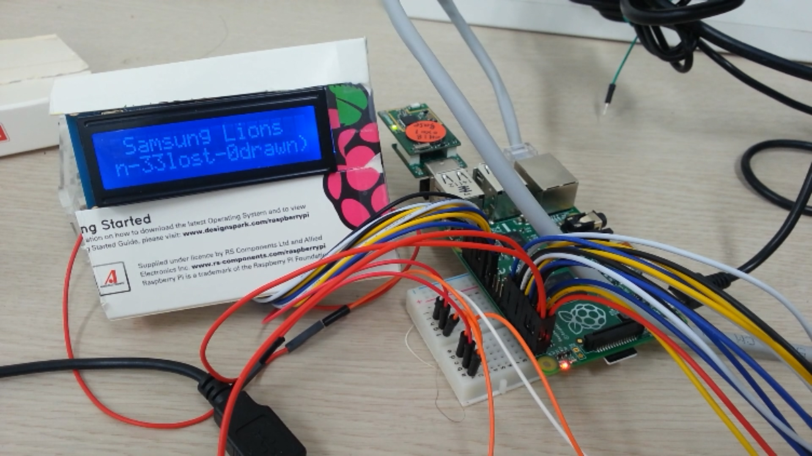
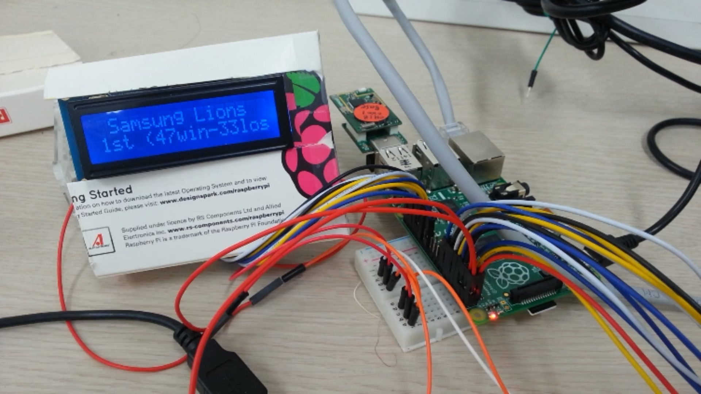
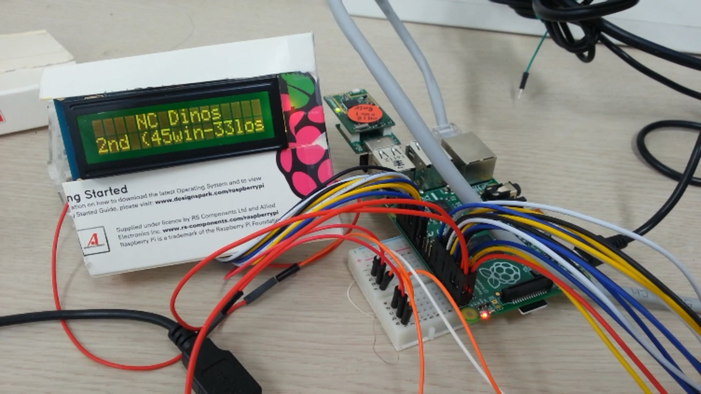
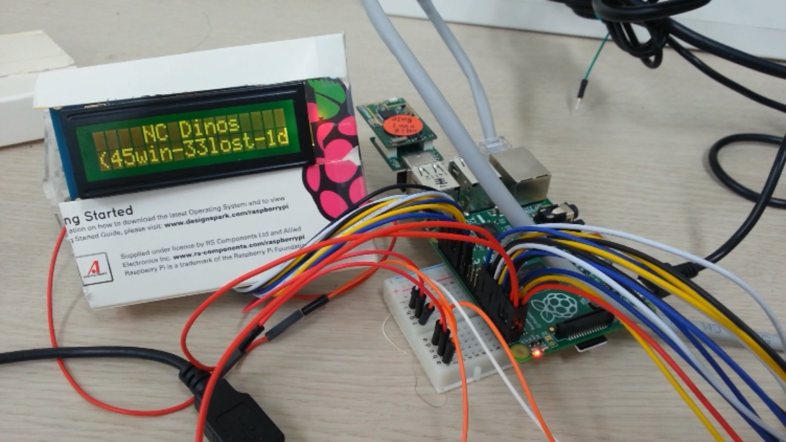

##**< 웹페이지에서 원하는 특정 정보 가져오기 >**  
  
####**1. 개요**  
네이버 스포츠에서 프로야구 페이지를 불러와서 현재 순위를 추출한뒤 이를 LCD를 통해 출력한다.  
또한, 각팀이 LCD에 표시될 때 팀의 응원가가 재생된다.
  
####**2. Python에서 HTML 페이지 가져오기**  
python에서 web page를 가져오는 방법은 몇가지가 있는듯하지만, 여기서는 제일 간단한 방법을 사용한다.  
python의 urllib2 모듈을 이용한다. 해당 모듈을 사용하기 위해서는 urllib2를 import한다.(import urllib2)  

    page = urllib2.urlopen("Web Page URL")
    text = page.read()
    print text

라고하면 원하는 web page의 html문서를 가져올 수 있다.  
Simple example code는 아래 링크에서 확인할 수 있다.  
https://github.com/ChanMinPark/DailyStudy/blob/master/htmlextraction/htmltest.py  

####**3. 네이버 프로야구 페이지에서 순위 추출하기**  
네이버 프로야구 순위 페이지를 읽어오면 아래와 같은 텍스트를 찾을 수 있다.  

    var jsonTeamRecord = {"regularTeamRecordList":[{"teamName":"삼성","winDiff":0,"lost":33,"teamCode":"SS","wra":0.588,"rank":1,"streak":"2패","bra":0.37,"won":47,"recentResult":"6승-4패-0무","gameCount":80,"drawn":0,"lra":0.467},{"teamName":"NC","winDiff":1,"lost":33,"teamCode":"NC","wra":0.577,"rank":2,"streak":"3승","bra":0.358,"won":45,"recentResult":"5승-5패-0무","gameCount":79,"drawn":1,"lra":0.451},{"teamName":"두산","winDiff":1,"lost":33,"teamCode":"OB","wra":0.577,"rank":2,"streak":"3승","bra":0.367,"won":45,"recentResult":"6승-4패-0무","gameCount":78,"drawn":0,"lra":0.428},{"teamName":"넥센","winDiff":3,"lost":37,"teamCode":"WO","wra":0.549,"rank":4,"streak":"2패","bra":0.372,"won":45,"recentResult":"5승-5패-0무","gameCount":83,"drawn":1,"lra":0.48},{"teamName":"한화","winDiff":4.5,"lost":38,"teamCode":"HH","wra":0.531,"rank":5,"streak":"2승","bra":0.355,"won":43,"recentResult":"6승-4패-0무","gameCount":81,"drawn":0,"lra":0.402},{"teamName":"SK","winDiff":6,"lost":38,"teamCode":"SK","wra":0.513,"rank":6,"streak":"2승","bra":0.349,"won":40,"recentResult":"6승-4패-0무","gameCount":79,"drawn":1,"lra":0.389},{"teamName":"KIA","winDiff":10,"lost":43,"teamCode":"HT","wra":0.463,"rank":7,"streak":"4패","bra":0.325,"won":37,"recentResult":"2승-8패-0무","gameCount":80,"drawn":0,"lra":0.381},{"teamName":"롯데","winDiff":11,"lost":45,"teamCode":"LT","wra":0.451,"rank":8,"streak":"3패","bra":0.351,"won":37,"recentResult":"3승-7패-0무","gameCount":82,"drawn":0,"lra":0.442},{"teamName":"LG","winDiff":12,"lost":47,"teamCode":"LG","wra":0.44,"rank":9,"streak":"2패","bra":0.339,"won":37,"recentResult":"3승-7패-0무","gameCount":85,"drawn":1,"lra":0.399},{"teamName":"kt","winDiff":21.5,"lost":56,"teamCode":"KT","wra":0.325,"rank":10,"streak":"2승","bra":0.341,"won":27,"recentResult":"7승-3패-0무","gameCount":83,"drawn":0,"lra":0.389}]};
  
해당 정보는 이미 순위별로 정렬되어 있다.  
획득한 텍스트를 split을 이용하여 원하는 정보를 추출하여 사용할 수 있다.  
전체 코드는 아래 링크에서 확인 할 수 있다.  
https://github.com/ChanMinPark/DailyStudy/blob/master/htmlextraction/getDatafromWeb.py  

####**4. 팀 응원가 재생**  
우선, 음원 파일을 py파일과 동일한 폴더에 위치 시킨다.(편리상)  
(Web에 있는 음원을 사용하기 위한 방법 : https://github.com/ChanMinPark/DailyStudy/blob/master/htmlextraction/HowtoPlayMusicofWeb.md)  
python에서 음악을 재생하기 위한 라이브러리는 여러가지가 있으나, 그중 pyglet과 pygame을 가장 많이 사용하는 것 같다.  
기본적인 라이브러리들은 wav파일만을 지원하기 때문에 대중적으로 사용되지 않고, 다양한 포맷을 지원하는 pyglet과 pygame을 이용한다.  
여기에서는 pygame을 사용했다. pyglet은 그래픽과 멀티미디어를 위한 라이브러리인데 SSH를 통해 라즈베리파이에 접근하기 때문에 디스플레이가 없다는 이유로 pyglet이 동작하지 않고 에러를 발생시킨다.  
pygame은 리눅스 환경에서 게임을 만들기 위한 라이브러리이다. 게임을 위한 만큼 음원에 대한 라이브러리도 지원한다.  
(pygame의 API : http://www.pygame.org/docs/ )  
  
pygame을 사용하기 위해서 우선 pygame 패키지를 설치한다. 기본적으로 리눅스에 설치가 되어 있다고 하는 것 같은데 확인을 해본다.  

    $sudo apt-get install python-pygame
pygame의 기본적인 예는 다음과 같다.  

    import pygame  
    
    if __name__ == '__main__':
      try:
        pygame.mixer.init()
        pygame.mixer.music.load("sound_test.mp3")
        pygame.mixer.music.play()
        #play를 하면 play가 끝나고 다음 라인으로 넘어가는 것이 아니고 그냥 실행만하고 다음 라인으로 넘어간다.
        #그래서 프로그램 종료를 막기 위해서 음악이 재생중이면 루프를 돌게 한다.
        while pygame.mixer.music.get_busy() == True:
          continue
      except KeyboardInterrupt:
        pass

####**5. 결과 화면**  
순위 정보는 LCD에 (팀명, 순위, 승-패-무)가 표시되며 팀마다 각기 다른 색으로 표시된다.  
순위와 승-패-무 는 길이가 길기때문에 흐르는 텍스트를 이용하여 모든 부분이 전부 표시된후 다음 팀을 표시한다.  
표시되는 팀이 바뀔때마다 팀에 맞는 응원가가 5mm오디오잭을 통해서 출력된다.

  
  
  
  
  
